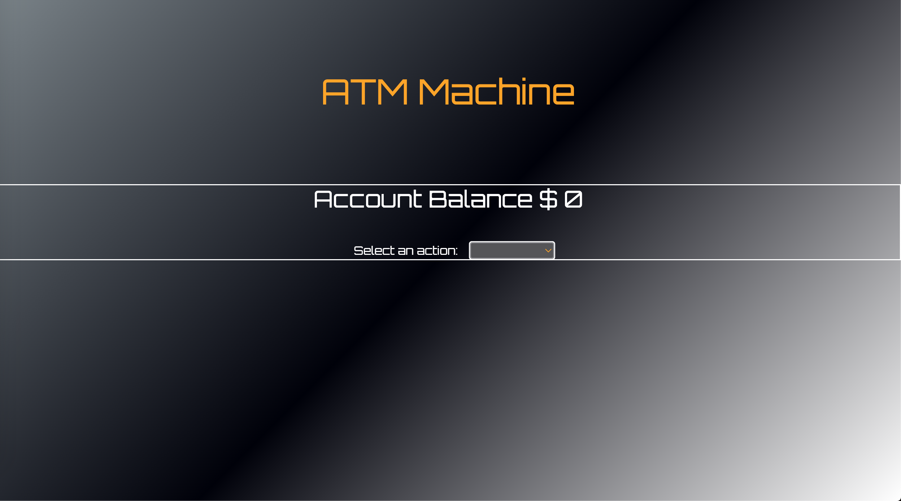
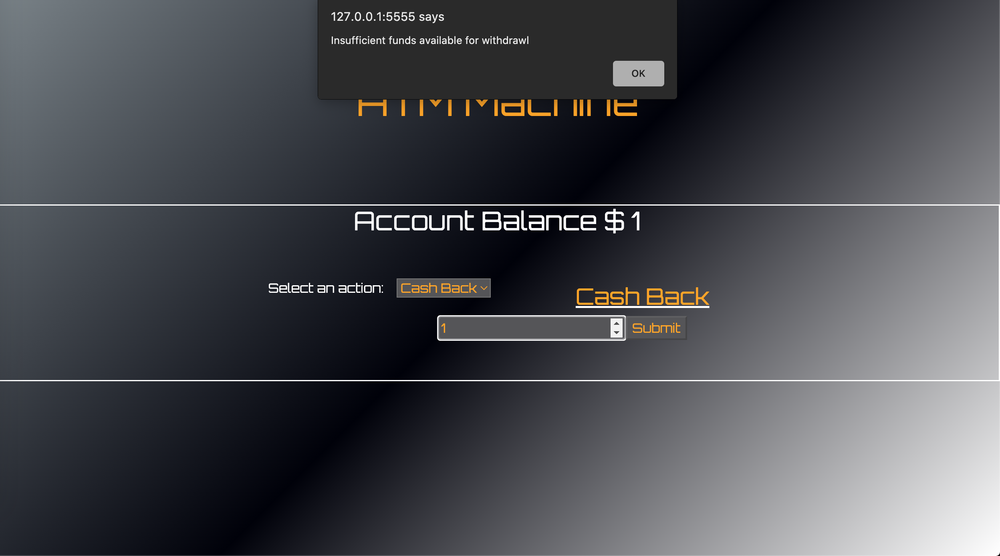

# ATMmachine

This assigment was completed for the MIT xPro Fullstack Development with MERN certificate program. Provided with starter code for a React ATM application, we were tasked with refactoring the code to add a drop down menu containing the option for deposit or cash back, and to adding validation so users can’t withdraw more money than is available in the account balance. I also added an alert box that notifies the user of "Insufficient funds available for withdrawl" when trying to get more cashback than is in the account. 

<h2>To run:</h2>
Everything required to run this project is in this repository. You're welcome to fork and clone this repository. Select either Deposit, or Cash Back from the drop-down menu and enter the $ amount in the input field. The app will keep track of how much is in the account, updating after each deposit/withdrawl. 

<h2>Roadmap of future improvements:</h2>
I will return to this code at a later date to create a way for the input field to revert to blank after Submit is pushed. I will also come back to add an option to view the balance of multiple accounts, and to add the option to choose between two or three sizes of bills for withdrawls, ex. $10, $20, $100 bills. 

<h2>Support:</h2>
Feel free to message me on LinkedIn (https://www.linkedin.com/in/anna-stegmann-77825b136/) if you have any questions.

<h2>License</h2>
MIT License Copyright (c) 2022 Anna Stegmann
Permission is hereby granted, free of charge, to any person obtaining a copy of this software and associated documentation files (the "Software"), to deal in the Software without restriction, including without limitation the rights to use, copy, modify, merge, publish, distribute, sublicense, and/or sell copies of the Software, and to permit persons to whom the Software is furnished to do so, subject to the following conditions:

The above copyright notice and this permission notice shall be included in all copies or substantial portions of the Software.

THE SOFTWARE IS PROVIDED "AS IS", WITHOUT WARRANTY OF ANY KIND, EXPRESS OR IMPLIED, INCLUDING BUT NOT LIMITED TO THE WARRANTIES OF MERCHANTABILITY, FITNESS FOR A PARTICULAR PURPOSE AND NONINFRINGEMENT. IN NO EVENT SHALL THE AUTHORS OR COPYRIGHT HOLDERS BE LIABLE FOR ANY CLAIM, DAMAGES OR OTHER LIABILITY, WHETHER IN AN ACTION OF CONTRACT, TORT OR OTHERWISE, ARISING FROM, OUT OF OR IN CONNECTION WITH THE SOFTWARE OR THE USE OR OTHER DEALINGS IN THE SOFTWARE.
